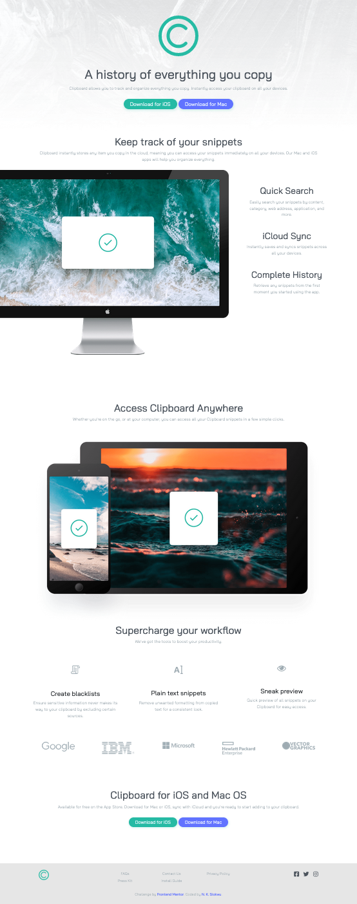

# Frontend Mentor - Clipboard landing page solution

This is a solution to the [Clipboard landing page challenge on Frontend Mentor](https://www.frontendmentor.io/challenges/clipboard-landing-page-5cc9bccd6c4c91111378ecb9). Frontend Mentor challenges help you improve your coding skills by building realistic projects. 

## Table of contents

- [Overview](#overview)
  - [The challenge](#the-challenge)
  - [Screenshot](#screenshot)
  - [Links](#links)
- [My process](#my-process)
  - [Built with](#built-with)
  - [What I learned](#what-i-learned)
  - [Useful resources](#useful-resources)
- [Author](#author)
- [Acknowledgments](#acknowledgments)

## Overview

### The challenge

Users should be able to:

- View the optimal layout for the site depending on their device's screen size
- See hover states for all interactive elements on the page

### Screenshot

### Links

- Solution URL: [View Repository](https://github.com/ladykays/clipboard-landing-page)
- Live Site URL: [View Deployed Site](https://extraordinary-sherbet-e03cdc.netlify.app/)

## My process 

### Built with

- Semantic HTML5 markup
- CSS custom properties
- Flexbox
- CSS Grid
- Mobile-first workflow
- Bootstrap 5

### What I learned

I had the chance to implement and apply several concepts that I've recently learned, including creating sections and leveraging Bootstrap 5. Moreover, I made a conscious effort to organize my code in a clear and understandable manner, ensuring it can be easily understood by fellow developers.

### Useful resources

- [CSS Reset](https://medium.com/swlh/css-reset-2b4831d4664e) - This helped me with CSS reset. I really liked this pattern and will use it going forward.

## Author

- Github - [N. K. Siokwu](https://github.com/ladykays)
- Frontend Mentor - [@ladykays](https://www.frontendmentor.io/profile/ladykays)
- Linkedin - [N. K. Siokwu](https://www.linkedin.com/in/ndidiamaka-siokwu-67b1a6267/)

## Acknowledgments

I am immensely grateful to the creators of Frontend Mentor for providing me with this valuable opportunity. The challenges they offer have been instrumental in allowing me to apply and enhance the knowledge and skills I have acquired.

